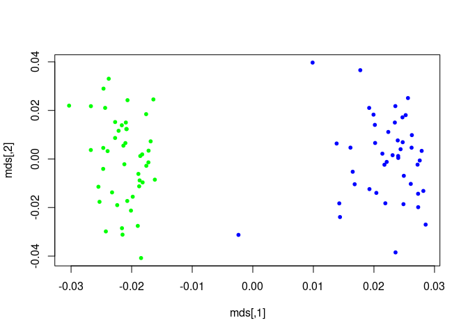

## Assignment 10 GWAS

### Genome-wide association studies (GWAS) use dense maps of SNPs that cover the human genome to look for allele-frequency differences between cases (patients with a specific disease or individuals with a certain trait) and controls.(<span class="citeproc-not-found" data-reference-id="1">**???**</span>) A significant frequency difference is taken to indicate that the corresponding region of the genome contains functional DNA-sequence variants that influence the disease or trait in question. (<span class="citeproc-not-found" data-reference-id="2">**???**</span>)

### The below example are using PLINK to analyse a dummy data of randomly selected genotypes from the 89 Asian HapMap individuals. We perform data management, summary statistics populationstratification and basic association analysis.(<span class="citeproc-not-found" data-reference-id="3">**???**</span>) In this research, a phenotype has been simulated based on the genotype at one SNP, roughl 80,000 autosomal SNPs are being analysised.

``` bash
plink --file hapmap1
plink --file hapmap1 --make-bed --out hapmap1
plink --file hapmap1 --make-bed --mind 0.05 --out highgeno
plink --bfile hapmap1
plink --bfile hapmap1 --missing --out miss_stat
more miss_stat.lmiss
more miss_stat.imiss
plink --bfile hapmap1 --chr 1 --out res1 --missing
plink --bfile hapmap1 --chr 2 --out res2 --missing
plink --bfile hapmap1 --freq --out freq_stat
plink --bfile hapmap1 --freq --within pop.phe --out freq_stat
more freq_stat.frq.strat
plink --bfile hapmap1 --snp rs1891905 --freq --within pop.phe --out snp1_frq_stat
plink --bfile hapmap1 --assoc --out as1
sort --key=7 -nr as1.assoc | head
plink --bfile hapmap1 --assoc --adjust --out as2
more as2.assoc.adjusted
```

``` bash
plink --bfile hapmap1 --pheno pop.phe --assoc --adjust --out as3
```

    ## PLINK v1.90b4.9 64-bit (13 Oct 2017)           www.cog-genomics.org/plink/1.9/
    ## (C) 2005-2017 Shaun Purcell, Christopher Chang   GNU General Public License v3
    ## Logging to as3.log.
    ## Options in effect:
    ##   --adjust
    ##   --assoc
    ##   --bfile hapmap1
    ##   --out as3
    ##   --pheno pop.phe
    ## 
    ## 193230 MB RAM detected; reserving 96615 MB for main workspace.
    ## 83534 variants loaded from .bim file.
    ## 89 people (89 males, 0 females) loaded from .fam.
    ## 89 phenotype values present after --pheno.
    ## Using 1 thread (no multithreaded calculations invoked).
    ## Before main variant filters, 89 founders and 0 nonfounders present.
    ## Calculating allele frequencies... 0%1%2%3%4%5%6%7%8%9%10%11%12%13%14%15%16%17%18%19%20%21%22%23%24%25%26%27%28%29%30%31%32%33%34%35%36%37%38%39%40%41%42%43%44%45%46%47%48%49%50%51%52%53%54%55%56%57%58%59%60%61%62%63%64%65%66%67%68%69%70%71%72%73%74%75%76%77%78%79%80%81%82%83%84%85%86%87%88%89%90%91%92%93%94%95%96%97%98%99% done.
    ## Total genotyping rate is 0.99441.
    ## 83534 variants and 89 people pass filters and QC.
    ## Among remaining phenotypes, 44 are cases and 45 are controls.
    ## Writing C/C --assoc report to as3.assoc ... 0%1%2%3%4%6%7%8%9%10%11%12%14%15%16%17%18%19%20%22%23%25%26%27%28%29%31%32%33%34%35%36%38%39%40%41%42%43%45%46%47%48%49%50%51%53%54%55%56%58%59%60%61%62%63%65%66%67%68%69%70%72%73%74%76%77%78%79%80%81%83%84%85%87%88%89%90%92%93%94%95%96%97%98%99%done.
    ## --adjust: Genomic inflation est. lambda (based on median chisq) = 1.78854.
    ## 0%1%2%3%4%5%6%7%8%9%10%11%12%13%14%15%16%17%18%19%20%21%22%23%24%25%26%27%28%29%30%31%32%33%34%35%36%37%38%39%40%41%42%43%44%45%46%47%48%49%50%51%52%53%54%55%56%57%58%59%60%61%62%63%64%65%66%67%68%69%70%71%72%73%74%75%76%77%78%79%80%81%82%83%84%85%86%87%88%89%90%91%92%93%94%95%96%97%98%99%--adjust values (68727 variants) written to as3.assoc.adjusted .

``` bash
plink --bfile hapmap1 --model --snp rs2222162 --out mod1
plink --bfile hapmap1 --model --cell 0 --snp rs2222162 --out mod2
plink --bfile hapmap1 --cluster --mc 2 --ppc 0.05 --out str1
more str1.cluster1
plink --bfile hapmap1 --mh --within str1.cluster2 --adjust --out aac1
more aac1.cmh.adjusted
plink --bfile hapmap1 --cluster --cc --ppc 0.01 --out version2
plink --bfile hapmap1 --mh --within version2.cluster2 --adjust --out aac2
plink --bfile hapmap1 --cluster --K 2 --out version3
plink --bfile hapmap1 --mh --within pop.phe --adjust --out aac3
plink --bfile hapmap1 --cluster --matrix --out ibd_view
```

``` r
m <- as.matrix(read.table("ibd_view.mibs"))
mds <- cmdscale(as.dist(1-m))
k <- c( rep("green",45) , rep("blue",44) )
plot(mds,pch=20,col=k)
```

<!-- -->

``` bash
plink --bfile hapmap1 --assoc --pheno qt.phe --out quant1
plink --bfile hapmap1 --assoc --pheno qt.phe --perm --within str1.cluster2 --out quant2
plink --bfile hapmap1 --assoc --pheno qt.phe --mperm 1000 --within str1.cluster2 --out quant3
plink --bfile hapmap1 --pheno qt.phe --gxe --covar pop.phe --snp rs2222162 --out quant3
plink --bfile hapmap1 --snp rs2222162 --recodeAD --out rec_snp1.recode
```

``` r
ss <- read.table("miss_stat.lmiss",header = T)
knitr::kable(head(ss),"markdown")
```

| CHR | SNP       | N\_MISS | N\_GENO | F\_MISS |
| --: | :-------- | ------: | ------: | ------: |
|   1 | rs6681049 |       0 |      89 |       0 |
|   1 | rs4074137 |       0 |      89 |       0 |
|   1 | rs7540009 |       0 |      89 |       0 |
|   1 | rs1891905 |       0 |      89 |       0 |
|   1 | rs9729550 |       0 |      89 |       0 |
|   1 | rs3813196 |       0 |      89 |       0 |

``` r
i <- read.table("miss_stat.imiss",header = T)
knitr::kable(head(i),"markdown")
```

| FID    | IID | MISS\_PHENO | N\_MISS | N\_GENO |  F\_MISS |
| :----- | --: | :---------- | ------: | ------: | -------: |
| HCB181 |   1 | N           |     671 |   83534 | 0.008033 |
| HCB182 |   1 | N           |    1156 |   83534 | 0.013840 |
| HCB183 |   1 | N           |     498 |   83534 | 0.005962 |
| HCB184 |   1 | N           |     412 |   83534 | 0.004932 |
| HCB185 |   1 | N           |     329 |   83534 | 0.003939 |
| HCB186 |   1 | N           |    1233 |   83534 | 0.014760 |

``` r
f <- read.table("freq_stat.frq.strat",header = T)
knitr::kable(head(f),"markdown")
```

| CHR | SNP       | CLST | A1 | A2 |     MAF | MAC | NCHROBS |
| --: | :-------- | ---: | -: | -: | ------: | --: | ------: |
|   1 | rs6681049 |    1 |  1 |  2 | 0.23330 |  21 |      90 |
|   1 | rs6681049 |    2 |  1 |  2 | 0.19320 |  17 |      88 |
|   1 | rs4074137 |    1 |  1 |  2 | 0.10000 |   9 |      90 |
|   1 | rs4074137 |    2 |  1 |  2 | 0.05682 |   5 |      88 |
|   1 | rs7540009 |    1 |  0 |  2 | 0.00000 |   0 |      90 |
|   1 | rs7540009 |    2 |  0 |  2 | 0.00000 |   0 |      88 |

``` r
a <- read.table("as1.assoc",header = T)
knitr::kable(head(a),"markdown")
```

| CHR | SNP       | BP | A1 |    F\_A |    F\_U | A2 |    CHISQ |       P |     OR |
| --: | :-------- | -: | -: | ------: | ------: | -: | -------: | ------: | -----: |
|   1 | rs6681049 |  1 |  1 | 0.15910 | 0.26670 |  2 | 3.067000 | 0.07991 | 0.5203 |
|   1 | rs4074137 |  2 |  1 | 0.07955 | 0.07778 |  2 | 0.001919 | 0.96510 | 1.0250 |
|   1 | rs7540009 |  3 |  0 | 0.00000 | 0.00000 |  2 |       NA |      NA |     NA |
|   1 | rs1891905 |  4 |  1 | 0.40910 | 0.40000 |  2 | 0.015270 | 0.90170 | 1.0380 |
|   1 | rs9729550 |  5 |  1 | 0.17050 | 0.08889 |  2 | 2.631000 | 0.10480 | 2.1060 |
|   1 | rs3813196 |  6 |  1 | 0.03409 | 0.02222 |  2 | 0.229600 | 0.63180 | 1.5530 |

``` r
as <- read.table("as2.assoc.adjusted",header = T)
knitr::kable(head(as),"markdown")
```

| CHR | SNP        |   UNADJ |       GC |   BONF |   HOLM | SIDAK\_SS | SIDAK\_SD | FDR\_BH | FDR\_BY |
| --: | :--------- | ------: | -------: | -----: | -----: | --------: | --------: | ------: | ------: |
|  13 | rs9585021  | 5.6e-06 | 4.99e-05 | 0.3839 | 0.3839 |    0.3188 |    0.3188 | 0.09719 |       1 |
|   2 | rs2222162  | 5.9e-06 | 5.23e-05 | 0.4068 | 0.4067 |    0.3342 |    0.3342 | 0.09719 |       1 |
|   9 | rs10810856 | 7.7e-06 | 6.48e-05 | 0.5308 | 0.5308 |    0.4118 |    0.4118 | 0.09719 |       1 |
|   2 | rs4675607  | 8.0e-06 | 6.70e-05 | 0.5533 | 0.5533 |    0.4249 |    0.4249 | 0.09719 |       1 |
|   2 | rs4673349  | 8.5e-06 | 6.99e-05 | 0.5832 | 0.5831 |    0.4419 |    0.4419 | 0.09719 |       1 |
|   2 | rs1375352  | 8.5e-06 | 6.99e-05 | 0.5832 | 0.5831 |    0.4419 |    0.4419 | 0.09719 |       1 |

``` r
as3 <- read.table("as3.assoc.adjusted",header = T)
knitr::kable(head(as3),"markdown")
```

| CHR | SNP        |   UNADJ |        GC |     BONF |     HOLM | SIDAK\_SS | SIDAK\_SD |  FDR\_BH | FDR\_BY |
| --: | :--------- | ------: | --------: | -------: | -------: | --------: | --------: | -------: | ------: |
|   8 | rs2585179  | 0.0e+00 | 0.0000322 | 0.001852 | 0.001852 |  0.001850 |  0.001850 | 0.001852 | 0.02169 |
|  11 | rs10768140 | 1.0e-07 | 0.0000545 | 0.004658 | 0.004658 |  0.004647 |  0.004647 | 0.002329 | 0.02728 |
|  15 | rs4468542  | 1.0e-07 | 0.0000739 | 0.007931 | 0.007930 |  0.007899 |  0.007899 | 0.002644 | 0.03097 |
|   6 | rs372440   | 7.0e-07 | 0.0002061 | 0.047590 | 0.047580 |  0.046470 |  0.046470 | 0.010820 | 0.12680 |
|   6 | rs9395476  | 1.1e-06 | 0.0002692 | 0.075770 | 0.075760 |  0.072970 |  0.072960 | 0.010820 | 0.12680 |
|   6 | rs512497   | 1.1e-06 | 0.0002692 | 0.075770 | 0.075760 |  0.072970 |  0.072960 | 0.010820 | 0.12680 |

``` r
aac <- read.table("aac1.cmh.adjusted",header = T)
knitr::kable(head(aac),"markdown")
```

| CHR | SNP       |    UNADJ |        GC |   BONF |   HOLM | SIDAK\_SS | SIDAK\_SD | FDR\_BH | FDR\_BY |
| --: | :-------- | -------: | --------: | -----: | -----: | --------: | --------: | ------: | ------: |
|  13 | rs9585021 | 1.90e-06 | 0.0000044 | 0.1274 | 0.1274 |    0.1196 |    0.1196 |  0.1274 |       1 |
|  21 | rs3017432 | 2.21e-05 | 0.0000433 | 1.0000 | 1.0000 |    0.7716 |    0.7716 |  0.7384 |       1 |
|   2 | rs2222162 | 4.47e-05 | 0.0000835 | 1.0000 | 1.0000 |    0.9496 |    0.9495 |  0.8734 |       1 |
|  17 | rs3829612 | 7.18e-05 | 0.0001299 | 1.0000 | 1.0000 |    0.9918 |    0.9918 |  0.8734 |       1 |
|   2 | rs4673349 | 9.62e-05 | 0.0001707 | 1.0000 | 1.0000 |    0.9984 |    0.9984 |  0.8734 |       1 |
|   2 | rs1375352 | 9.62e-05 | 0.0001707 | 1.0000 | 1.0000 |    0.9984 |    0.9984 |  0.8734 |       1 |

``` r
aac2 <- read.table("aac2.cmh.adjusted",header = T)
knitr::kable(head(aac2),"markdown")
```

| CHR | SNP       |    UNADJ |       GC |     BONF |     HOLM | SIDAK\_SS | SIDAK\_SD |  FDR\_BH | FDR\_BY |
| --: | :-------- | -------: | -------: | -------: | -------: | --------: | --------: | -------: | ------: |
|   2 | rs2222162 | 0.00e+00 | 0.00e+00 | 0.001013 | 0.001013 |  0.001013 |  0.001013 | 0.001013 | 0.01187 |
|   2 | rs4675607 | 1.13e-05 | 1.48e-05 | 0.779400 | 0.779400 |  0.541300 |  0.541300 | 0.277900 | 1.00000 |
|  13 | rs9585021 | 1.21e-05 | 1.58e-05 | 0.833800 | 0.833800 |  0.565600 |  0.565600 | 0.277900 | 1.00000 |
|   9 | rs7046471 | 3.37e-05 | 4.28e-05 | 1.000000 | 1.000000 |  0.901500 |  0.901500 | 0.429600 | 1.00000 |
|   2 | rs4673349 | 3.75e-05 | 4.75e-05 | 1.000000 | 1.000000 |  0.924000 |  0.924000 | 0.429600 | 1.00000 |
|   2 | rs1375352 | 3.75e-05 | 4.75e-05 | 1.000000 | 1.000000 |  0.924000 |  0.924000 | 0.429600 | 1.00000 |

``` r
aac3 <- read.table("aac3.cmh.adjusted",header = T)
knitr::kable(head(aac3),"markdown")
```

| CHR | SNP       |    UNADJ |       GC |      BONF |      HOLM | SIDAK\_SS | SIDAK\_SD |   FDR\_BH |   FDR\_BY |
| --: | :-------- | -------: | -------: | --------: | --------: | --------: | --------: | --------: | --------: |
|   2 | rs2222162 | 0.00e+00 | 0.00e+00 | 0.0000178 | 0.0000178 | 0.0000178 | 0.0000178 | 0.0000178 | 0.0002089 |
|   2 | rs4675607 | 4.00e-06 | 4.00e-06 | 0.2770000 | 0.2770000 | 0.2419000 | 0.2419000 | 0.1385000 | 1.0000000 |
|   2 | rs4673349 | 1.20e-05 | 1.20e-05 | 0.8276000 | 0.8276000 | 0.5629000 | 0.5629000 | 0.1679000 | 1.0000000 |
|   2 | rs1375352 | 1.20e-05 | 1.20e-05 | 0.8276000 | 0.8276000 | 0.5629000 | 0.5629000 | 0.1679000 | 1.0000000 |
|  13 | rs9585021 | 1.22e-05 | 1.22e-05 | 0.8395000 | 0.8395000 | 0.5681000 | 0.5681000 | 0.1679000 | 1.0000000 |
|   2 | rs2176427 | 4.31e-05 | 4.31e-05 | 1.0000000 | 1.0000000 | 0.9483000 | 0.9483000 | 0.4936000 | 1.0000000 |

``` r
m <- read.table("mod1.model",header = T)
knitr::kable(m, "markdown")
```

| CHR | SNP       | A1 | A2 | TEST    | AFF     | UNAFF   | CHISQ | DF |        P |
| --: | :-------- | -: | -: | :------ | :------ | :------ | ----: | -: | -------: |
|   2 | rs2222162 |  1 |  2 | GENO    | 3/19/22 | 17/22/6 |    NA | NA |       NA |
|   2 | rs2222162 |  1 |  2 | TREND   | 25/63   | 56/34   | 19.15 |  1 | 1.21e-05 |
|   2 | rs2222162 |  1 |  2 | ALLELIC | 25/63   | 56/34   | 20.51 |  1 | 5.90e-06 |
|   2 | rs2222162 |  1 |  2 | DOM     | 22/22   | 39/6    |    NA | NA |       NA |
|   2 | rs2222162 |  1 |  2 | REC     | 3/41    | 17/28   |    NA | NA |       NA |

``` r
m <- read.table("mod2.model",header = T)
knitr::kable(m, "markdown")
```

| CHR | SNP       | A1 | A2 | TEST    | AFF     | UNAFF   | CHISQ | DF |         P |
| --: | :-------- | -: | -: | :------ | :------ | :------ | ----: | -: | --------: |
|   2 | rs2222162 |  1 |  2 | GENO    | 3/19/22 | 17/22/6 | 19.15 |  2 | 0.0000693 |
|   2 | rs2222162 |  1 |  2 | TREND   | 25/63   | 56/34   | 19.15 |  1 | 0.0000121 |
|   2 | rs2222162 |  1 |  2 | ALLELIC | 25/63   | 56/34   | 20.51 |  1 | 0.0000059 |
|   2 | rs2222162 |  1 |  2 | DOM     | 22/22   | 39/6    | 13.87 |  1 | 0.0001958 |
|   2 | rs2222162 |  1 |  2 | REC     | 3/41    | 17/28   | 12.24 |  1 | 0.0004679 |

``` r
quant1.qassoc  <- read.table("quant1.qassoc",header = T)
knitr::kable(head(quant1.qassoc),"markdown")
```

| CHR | SNP       | BP | NMISS |     BETA |     SE |       R2 |        T |      P |
| --: | :-------- | -: | ----: | -------: | -----: | -------: | -------: | -----: |
|   1 | rs6681049 |  1 |    89 | \-0.2266 | 0.3626 | 0.004469 | \-0.6249 | 0.5336 |
|   1 | rs4074137 |  2 |    89 | \-0.2949 | 0.6005 | 0.002765 | \-0.4911 | 0.6246 |
|   1 | rs7540009 |  3 |    89 |       NA |     NA |       NA |       NA |     NA |
|   1 | rs1891905 |  4 |    89 | \-0.1053 | 0.3165 | 0.001272 | \-0.3328 | 0.7401 |
|   1 | rs9729550 |  5 |    89 |   0.5402 | 0.4616 | 0.015500 |   1.1700 | 0.2451 |
|   1 | rs3813196 |  6 |    89 |   0.8053 | 1.0250 | 0.007050 |   0.7859 | 0.4340 |

``` r
quant2.qassoc  <- read.table("quant2.qassoc",header = T)
knitr::kable(head(quant2.qassoc),"markdown")
```

| CHR | SNP       | BP | NMISS |     BETA |     SE |       R2 |        T |      P |
| --: | :-------- | -: | ----: | -------: | -----: | -------: | -------: | -----: |
|   1 | rs6681049 |  1 |    89 | \-0.2266 | 0.3626 | 0.004469 | \-0.6249 | 0.5336 |
|   1 | rs4074137 |  2 |    89 | \-0.2949 | 0.6005 | 0.002765 | \-0.4911 | 0.6246 |
|   1 | rs7540009 |  3 |    89 |       NA |     NA |       NA |       NA |     NA |
|   1 | rs1891905 |  4 |    89 | \-0.1053 | 0.3165 | 0.001272 | \-0.3328 | 0.7401 |
|   1 | rs9729550 |  5 |    89 |   0.5402 | 0.4616 | 0.015500 |   1.1700 | 0.2451 |
|   1 | rs3813196 |  6 |    89 |   0.8053 | 1.0250 | 0.007050 |   0.7859 | 0.4340 |

``` r
quant3.qassoc  <- read.table("quant3.qassoc",header = T)
knitr::kable(head(quant3.qassoc),"markdown")
```

| CHR | SNP       | BP | NMISS |     BETA |     SE |       R2 |        T |      P |
| --: | :-------- | -: | ----: | -------: | -----: | -------: | -------: | -----: |
|   1 | rs6681049 |  1 |    89 | \-0.2266 | 0.3626 | 0.004469 | \-0.6249 | 0.5336 |
|   1 | rs4074137 |  2 |    89 | \-0.2949 | 0.6005 | 0.002765 | \-0.4911 | 0.6246 |
|   1 | rs7540009 |  3 |    89 |       NA |     NA |       NA |       NA |     NA |
|   1 | rs1891905 |  4 |    89 | \-0.1053 | 0.3165 | 0.001272 | \-0.3328 | 0.7401 |
|   1 | rs9729550 |  5 |    89 |   0.5402 | 0.4616 | 0.015500 |   1.1700 | 0.2451 |
|   1 | rs3813196 |  6 |    89 |   0.8053 | 1.0250 | 0.007050 |   0.7859 | 0.4340 |

``` r
d <- read.table("rec_snp1.recode.raw" , header=T)
summary(glm(PHENOTYPE-1 ~ rs2222162_1, data=d, family="binomial"))
```

    ## 
    ## Call:
    ## glm(formula = PHENOTYPE - 1 ~ rs2222162_1, family = "binomial", 
    ##     data = d)
    ## 
    ## Deviance Residuals: 
    ##     Min       1Q   Median       3Q      Max  
    ## -1.7690  -1.1042  -0.5848   0.6851   1.9238  
    ## 
    ## Coefficients:
    ##             Estimate Std. Error z value Pr(>|z|)    
    ## (Intercept)   1.3300     0.4107   3.238   0.0012 ** 
    ## rs2222162_1  -1.5047     0.3765  -3.997 6.42e-05 ***
    ## ---
    ## Signif. codes:  0 '***' 0.001 '**' 0.01 '*' 0.05 '.' 0.1 ' ' 1
    ## 
    ## (Dispersion parameter for binomial family taken to be 1)
    ## 
    ##     Null deviance: 123.37  on 88  degrees of freedom
    ## Residual deviance: 102.64  on 87  degrees of freedom
    ## AIC: 106.64
    ## 
    ## Number of Fisher Scoring iterations: 4
